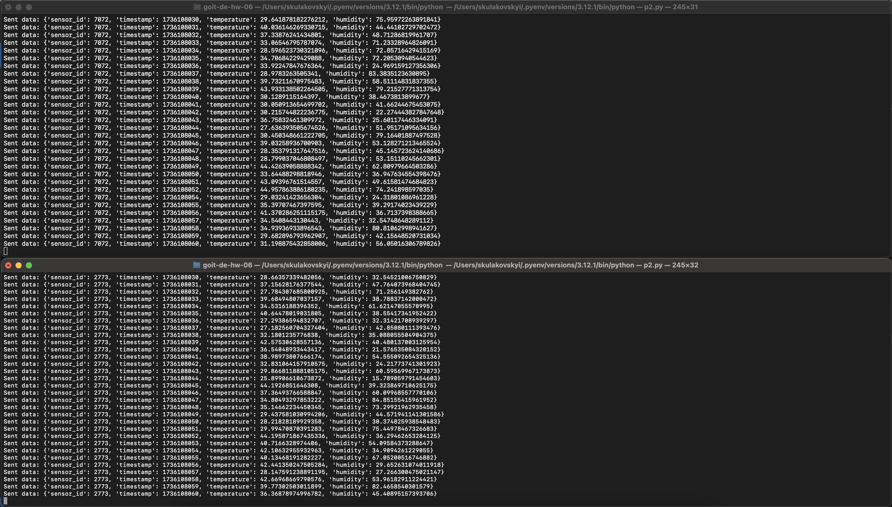

# goit-de-hw-06

#### скрин генерації даних сенсорів та відправки даних в building_sensors з демонстрацією двох (або більше) одночасних роботи двох запусків програми

#### скрин з демонстрацією того, що відфільтровані дані були послані у відповідні топіки

